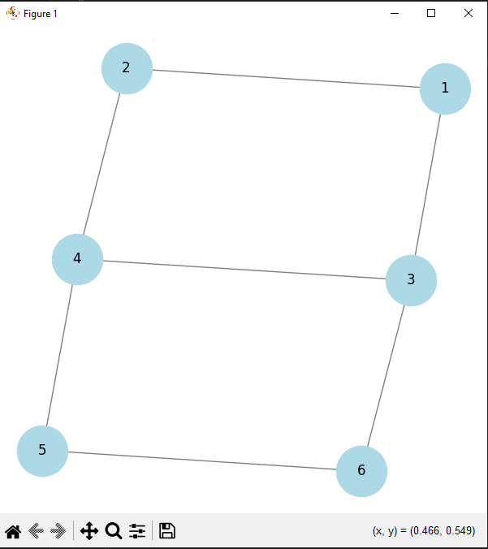

# Graph Analytics Visualizer

A Python-based tool to visualize and analyze graph structures using NetworkX and Matplotlib. This tool includes graph traversal (BFS & DFS), cycle detection, and shortest path computation.
Features

• Graph Visualization: Displays nodes and edges using Matplotlib
• BFS (Breadth-First Search): Explores nodes level by level
• DFS (Depth-First Search): Explores paths deeply before backtracking
• Cycle Detection: Detects cycles in the graph
• Shortest Path Calculation: Computes the shortest path between two nodes

# Technologies Used

• Python

• NetworkX (for graph operations)

• Matplotlib (for visualization)

# Code Overview

• draw_graph(graph) → Visualizes the graph

• bfs(graph, start) → Runs BFS traversal

• dfs(graph, start) → Runs DFS traversal

• has_cycle(graph) → Checks for cycles

• shortest_path(graph, start, end) → Computes shortest path

# Example Output

BFS Traversal: {1, 2, 3, 4, 5, 6}
DFS Traversal: {1, 2, 4, 3, 6, 5}
Cycle Detected: [(3, 4, 'forward'), (4, 5, 'forward'), (5, 6, 'forward'), (6, 3, 'forward')]
Shortest Path (1 -> 5): [1, 3, 4, 5]

# Graph Visualization 

